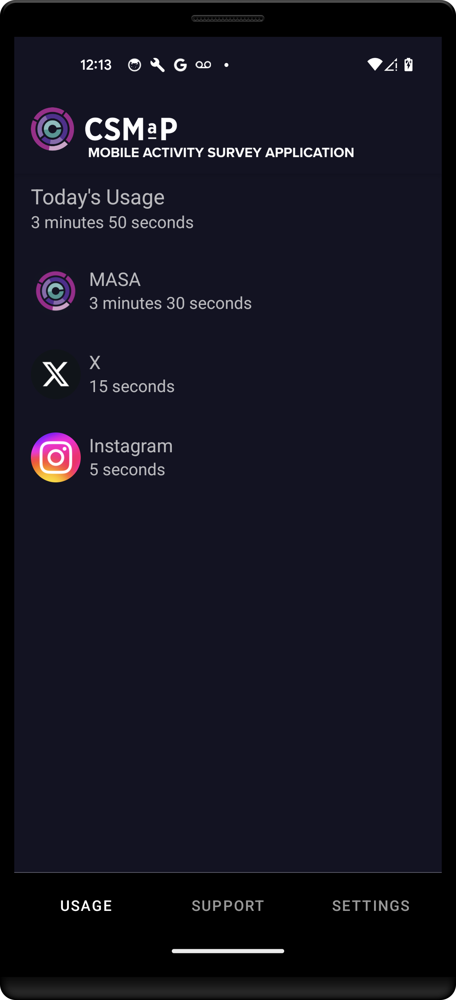
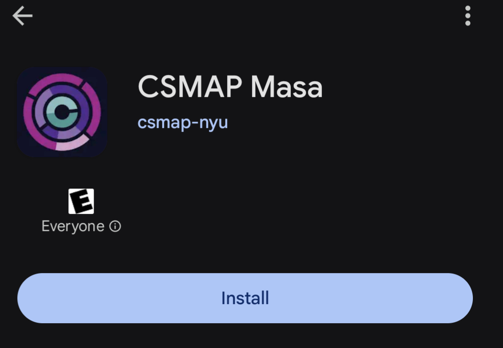
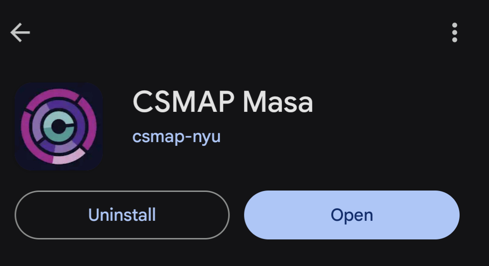
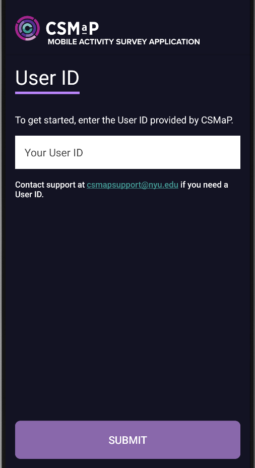

# About

[Overview](#overview) 
[How to install](#install) 
[How to onboard](#onboard) 

**MASA** is an Android application developed by research engineers at the  New York University's <a href="https://csmapnyu.org/"> Center of Social Media and Politics</a>(CSMaP) in collaboration with <a href="https://audacious-software.com">Audacious Software</a>.The application collects information from registered and consenting research participants about the time they spend on specific apps they grant us access to

The app collects real time app usage data–like how many minutes you used Facebook and X on your phone. You can only participate if you are recruited into a study and have been provided with a user ID at the start of the survey. The provided user ID is used throughout the study, including when registering and using the MASA app.

# Overview {#overview}
A successfully registered CSMaP MASA app looks like below 

#### USAGE
Provides information on real time app usage for apps that are being monitored in the study within the day
#### SUPPORT 
Provides information on how to request for assistance for technical and other issues with the app and also inquire about the study
#### SETTINGS
Provides information about the user, app and, data transmission settings. Information about the app technology information is also provided. Within this tab a user can update apps to be monitored and update data transmission settings they authorized during the onboarding process 

# How to install {#install}
1. On your Android device search for **Google Play Store** App 
2. On the **Google Play Store** app search for **CSMAP Masa** the click on the App as shown below
 
3. Press **Install** button

4. After installation completes press the **Open** button

# How to onboard and register {#onboard}
1. Follow the onboarding instructions by pressing the purple highlighted buttons
2. On the User ID screen please enter the user ID provided for the study 

3. Follow the onboarding steps 2 through 5 

Please see our <a href="https://www.csmapsurveys.org/privacy_policy_masa.html">Privacy Policy</a> for more information on what MASA app collects and handles the information collected. 
If there is anything about the study or your participation that is unclear or technical issue while using the app that you need resolved, please contact our <a href="mailto:sr6276@nyu.edu">research team</a>.
	
	
