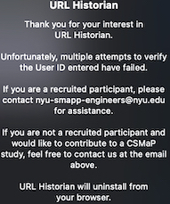

<html>
<head>
	<h1>Testing Instruction</h1>
</head>
<body>

These purpose of these tests is to ensure that the URL Historian functionality is as expected as well as help the developers make any necessary modification pertaining to data collection, deletion, pause, activation, and blacklisting  functionality and overall user experience
The data that will be collected during testing phase will be deleted from our storage and will not be used for CSMaP research purposes. 

The CSMaP team appreciates your support in testing the extension. 

	<h2> Overview of the tasks you will perform </h2>
		<ol>
			<li> Installing the extension from the Chrome web store</li>
			<li> Activating the extension for testing</li>
			<li> Sharing page content</li>
			<li> Navigate to specific set of URLs</li>
			<li> Navigate Youtube</li>
			<li> Navigate Facebook</li>
			<li> Navigate Twitter </li>
			<li> Use core functions of the extension</li>
		</ol>

	<h2>Installing and Activating the Extension</h2>
	<ol>
		<li>Follow instructions on Installing and activating the extension demo below</li>
			<video width="320" height="240" controls>
	  		<source src="videos/uh_activate.mp4" type="video/mp4"></video>
		<li>Click <a href="https://chrome.google.com/webstore/detail/url-historian/imdfbahhoamgbblienjdoeafphlngdim/related?hl=en" target="_blank" rel="noopener noreferrer">here to install</a> </li>
	  	<li> Activate the extension using the user ID provided with your email</li>
	 </ol>

 

	<h2>Sharing Page Content</h2>
	<ol>
		<li>Follow instructions below to allow sharing of social media website page content</li>
			<video width="320" height="240" controls>
	  		<source src="videos/uh_page_content.mp4" type="video/mp4"></video>
	  	<li> Allow Share Page content</li>
	 </ol>

 

	<h2> Navigating to specific set of URLs</h2>
	
 Click the links below to visit associated websites

	<ol>
		<li><a href="https://www.google.com" target="_blank" rel="noopener noreferrer">www.google.com</a></li>
		<li><a href="https://www.nytimes.com/2020/08/21/movies/tenet-review-christopher-nolan.html" target="_blank" rel="noopener noreferrer">www.nytimes.com/2020/08/21/movies/tenet-review-christopher-nolan.html</a></li>
		<li><a href="https://www.cnn.com/style/article/birkenstocks-history-comfortable-shoes-sandals/index.html" target="_blank" rel="noopener noreferrer">www.cnn.com/style/article/birkenstocks-history-comfortable-shoes-sandals/index.html</a></li>
		<li><a href="https://www.nyu.edu" target="_blank" rel="noopener noreferrer">www.nyu.edu</a></li>
	</ol>

	<h2> Navigate Youtube</h2>
	
 Click the link below to visit Youtube

	<ol>
		<li>Click <a href="https:www.youtube.com" target="_blank" rel="noopener noreferrer">www.youtube.com<a/></li>
		<li>Click on any YouTube video of your interest on your home page</li>
		<li>Click on 2 more Youtube video of your interest sequentially without watching the content</li>
		<li>Click <a href="https:www.youtube.com" target="_blank" rel="noopener noreferrer">www.youtube.com<a/></li>
		<li>After 10 minutes, close both tabs running YouTube</li>
	</ol>

	<h2> Navigate to Facebook</h2>
	
 If you have Facebook Login to your account (if not logged in)

	<ol>
		<li>Click on one of your friends page<a/></li>
		<li>Click on your messages tab and onto any of your messages </li>
		<li>Click on your groups and then click to a specific group you are a member</li>
		<li>Click on your stories tab and view any stories</li>
		<li>Click on watch tab and then on video on your watch page</li>
		<li>Click on marketplace and then to any item on sale displayed on your page</li>
	</ol>

	<h2> Navigate to Twitter</h2>
	
 If you have Twitter Account Login to your account (if not logged in)

	<ol>
		<li>Click on one of your friends page<a/></li>
		<li>Click on your messages tab and onto any of your messages </li>
		<li>Click on your groups and then click to a specific group you are a member</li>
		<li>Click on your stories tab and view any stories</li>
		<li>Click on watch tab and then on video on your watch page</li>
		<li>Click on marketplace and then to any item on sale displayed on your page</li>
	</ol>

Pause / Activate Data Collection: pause and reactivate the activity of the plugin by toggling the purple switch at the top right corner of the popup window. The pop-up displays “Active” next to the switch when the plugin is active, and “Paused” when the plugin is paused. 

After the plugin is paused for 60 minutes, it sends an reminder for you to reactivate the plugin: 

Please wait 12-24 hours before following the next steps. While the extension is paused it will not be sending your browsing data to our databases. 
Unpause the extension and visit a few more URLs
In this order, please visit:
https://www.youtube.com/
Any YouTube video on your home page that you would like to click on
https://www.nyu.edu/
https://www.washingtonpost.com/entertainment/music/qanda-with-yo-yo-ma-how-music-can-be-like-touch-during-these-socially-distant-times/2020/08/13/9725a22c-db07-11ea-8051-d5f887d73381_story.html
https://csmapnyu.org/

Delete data from yesterday
Delete Collected Data - delete your individual data by clicking either the “by Date” or the “by Time” button in the “Delete browse history” section.

In both “by Date” and “by Time”, you should select which time zone you were in on the date of access. The default time zone is (UTC-04:00) Eastern Time (US and Canada). 

By clicking on the “by Date” button, you can select a date from the past 7 days (including today). All stored data on the day will be deleted from the database. 

Selectable dates are dynamically restricted to the past 7 days. The user can search for available time zones using keywords. A confirmation window will pop up in the end to prevent user errors.

Please delete the day’s worth of data from yesterday. 

Add a webpage to the blacklisted sites.

Set a “Blacklist” - you create a list of web domains by entering websites in the “Blacklist a website” section. Pages from these domains will not be sent to our database.

The user can remove a blacklisted website by clicking on the red x next to the website’s URL address.

Please add “www.cnn.com” to the blacklisted sites.

Visit this web page: https://www.cnn.com/travel/destinations/colorado.

After this, you can remove the extension from the browser by right-clicking the icon and clicking “Remove from Chrome”. 
We appreciate your help with the testing! Please email nyu-smapp-engineers@nyu.edu if you run into any problems with the plug in. 

Thank you for downloading the CSMaP URL Historian. Your data will support research on political knowledge, online behavior, and public opinion. The CSMaP URL Historian is a Chrome plug-in that allows you to share your data with the CSMaP research team. If at any time you wish to stop sharing your data, you can contact us at [nyu-smapp-engineers@nyu.edu](mailto:nyu-smapp-engineers@nyu.edu).

Participation in web browsing collection is voluntary. You can delete data for up to one week via the extension. To delete data farther back than one week, please contact [nyu-smapp-engineers@nyu.edu](mailto:nyu-smapp-engineers@nyu.edu).

For any questions regarding the use of the extension, the data we collect, or the research that your data will be used in, please contact [csmap-surveys@nyu.edu](mailto:csmap-surveys@nyu.edu). 

URL Historian is a Chrome extension that enables the collection of web browsing activities or website content in real-time. It collects browsing data for research purposes from research participants who opt-in to share their browsing history and page content when browsing Twitter, Facebook and Youtube. Page content information is collected if the research participant opt-in and the data collected is only for the social media site(s) opted for. 

The extension provides visualization feature that beautifully displays the participant's locally stored browsing history. The visual displays reflects browsing habits such as frequency of visits and word searches on search engines, visits times in a heatmap graph, and visit details in a tabulated format. Importantly, the visualization information presented remains in the user's local machine and is composed of the entirety browsing history. Therefore, websites visit before and during extension installation is used to generate the visualizations. Of the entire browsing history displayed, the extension only collects information the participant has opted to be collected.

Collected data is securely stored in Amazon Web Services(AWS) and only accessible to the CSMaP research team. The extension is available in the Chrome Web Store and accessible via invitation only.

## FREQUENTLY ASKED QUESTIONS
<!-- 1. [What if I install and forget to activate the extension?](https://github.com/csmap-surveys/csmap-surveys.github.io/blob/main/csmap_url_historian.md#what-if-i-install-and-forget-to-activate-the-extension) 
2. [How do I pause and reactivate the extension?](https://github.com/csmap-surveys/csmap-surveys.github.io/blob/main/csmap_url_historian.md#how-do-i-pause-and-reactivate-the-extension)
3. [Can I delete data collected from me?](https://github.com/csmap-surveys/csmap-surveys.github.io/blob/main/csmap_url_historian.md#can-i-delete-data-collected-from-me)
4. [How can I prevent the extension from recording visits to websites that I wish to keep private?](https://github.com/csmap-surveys/csmap-surveys.github.io/blob/main/csmap_url_historian.md#how-can-i-prevent-the-extension-from-recording-visits-to-websites-that-i-wish-to-keep-private)
5. [What should I do if I forget my login ID?](https://github.com/csmap-surveys/csmap-surveys.github.io/blob/main/csmap_url_historian.md#what-should-i-do-if-i-forget-my-login-id)
6. [What do I do if the extension uninstalls itself and not because of failed attempts?](https://github.com/csmap-surveys/csmap-surveys.github.io/blob/main/csmap_url_historian.md#what-do-i-do-if-the-extension-uninstalls-itself-and-not-because-of-failed-attempts)
7. [Who should I contact for further information?](https://github.com/csmap-surveys/csmap-surveys.github.io/blob/main/csmap_url_historian.md#-who-should-i-contact-for-further-information)
 -->

	<h2>What if I install and forget to activate the extension?</h2>
	
The extension will send you a reminder 5 minutes after installing and every 30-minutes until you activate it.

	

	<h2>How do I pause and reactivate the extension?</h2>
	<ol>
		<li>Slide the toggle button to the left to pause, and to the right to reactivate the extension.</li>
		

			<iframe width="560" height="315" src="https://www.youtube.com/embed/Z9z7SfkZp0Q"></iframe>
			<!-- <iframe width="320" height="240" src="https://youtu.be/embed/Z9z7SfkZp0Q" ></iframe> -->
		

		<li>The extension will send you reminders after you have paused the extension for 60 minutes. After the first reminder, it will send follow-ups in 4-hour intervals.</li>
	</ol>

 	<h2>Can I delete data collected from me?</h2>
	
Yes, we currently allow users to delete data within the past 7 days. (You can contact our research team at <a href="mailto:nyu-smapp-engineers@nyu.edu">nyu-smapp-engineers@nyu.edu</a> to request data deletion beyond the 7-day time frame.)

	
You can also delete data collected within the specified date and time frame or date will be permanently deleted from our storage.

	
<h2> Delete by date and time</h2>

	

		<video width="600" height="400" controls>
	  		<source src="videos/uh_delbytime.mp4" type="video/mp4">
		</video>
	

	
<h2> Delete by date</h2>

	

		<video width="320" height="240" controls>
	  		<source src="videos/uh_delbydate.mp4" type="video/mp4">
		</video>
	

	<h2>How can I prevent the extension from recording visits to websites that I wish to keep private?</h2>
	
You can set up a list of web domains that you wish to keep private in <strong>Add Website to Blacklist</strong>

	

		<video width="320" height="240" controls>
  			<source src="https://drive.google.com/drive/folders/1nMx4FD1pxOGmRsGfAKccFzHCrk8SrkcE" type="video/mp4">
		</video>
	

	
The URL will be added to the list of <strong>Websites currently Blacklisted</strong>. When you visit any of these sites, we will not record the URLs.
 
	
You can remove a blacklisted website from <strong>Websites currently Blacklisted</strong> by 
 
	

		<video width="300" height="240" controls>
	  		<source src="videos/uh_unblacklist.mp4" type="video/mp4">
		</video>
	

	<h2>What should I do if I forget my login ID?</h2>
	
You can always find your User ID in your survey. You have 5 login attempts to activate the extension.

	
 With each failed attempt a notification message will popup.

	

	
After 5 failed login attempts, the extension will auto uninstall, you should contact us at <a href="mailto:nyu-smapp-engineers@nyu.edu"> nyu-smapp-engineers@nyu.edu</a> for assistance.

	

	<h2>What do I do if the extension uninstalls itself and not because of failed attempts?</h2>
	
This is meant to happen based on the study. A notification will popup informing you that the extension will auto uninstall. If you believe this happened due to an error, please contact  <a href="mailto:csmap-surveys@nyu.edu">csmap-surveys@nyu.edu</a>

	

	<h2> Who should I contact for further information?</h2>
	<ol>
		<li>For any questions on using the extension, requesting data deletion or other technical problems, please reach out to nyu-smapp-engineers@nyu.edu</li>
		<li>For any questions regarding the use of the extension, the data we collect, or the research projects that your data will be used in, please contact <a href="mailto:csmap-surveys@nyu.edu">csmap-surveys@nyu.edu</a> for assistance</li>
	</ol>

</body>
</html>