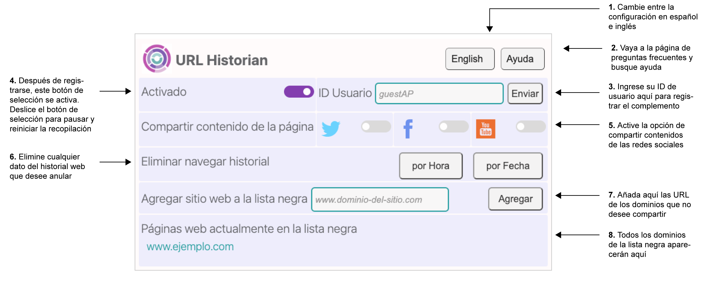

[Descripción general](#descripciongeneral) 
[Cómo instalar](#comoinstalar) 
[Divulgación de privacidad](#divulgaciondeprivacidad) 

#### URL Historian es una extensión de Chrome desarrollada por el <a href="https://csmapnyu.org/">Center for Social Media and Politics (CSMaP) </a> de la Universidad de Nueva York. Esta extensión permite que los participantes compartan datos que contribuyen a una mejor comprensión de cómo nuestro entorno en línea en constante cambio impacta la política y la democracia.

## Descripción general {#descripciongeneral}
Al activar y registrar el complemento URL Historian, este comienza a recopilar automáticamente las URL visitadas. Los datos recopilados a través de URL Historian son anónimos y se utilizan solo con fines académicos. Todos los datos recopilados se almacenan de forma segura en Amazon Web Services (AWS) y solo los investigadores de CSMaP pueden acceder a ellos.
1. Puede establecer el idioma predeterminado de la extensión al español usando la opción **"Español"**.
2. Haga clic en el botón **"Ayuda"** para ir a Preguntas frecuentes en su navegador.
3. Use el campo ID de usuario para ingresar su ID de usuario único después de contestar una encuesta.
4. Puede pausar la recopilación de datos mediante el botón **"Activo"**. Al registrar la extensión, la configuración por defecto de este botón de selección es “Activo”.
5. Los botones para **Compartir el contenido de la página** le permiten compartir información de las redes sociales. Este paso es opcional, consulte nuestra <a href="https://www.csmapsurveys.org/csmap_privacy_policy_es.html">política de privacidad </a> para obtener más información sobre qué datos de las redes sociales se recopilan.
6. **Borrar el historial de navegación** le permite revocar los datos que has compartido por hora o fecha.
7. El campo **Añadir sitio web a la lista negra** le permite incluir dominios que no desea que se recopilen.
8. El área denominada **Sitios web actualmente en la lista negra** mostrará todos los dominios que ha bloqueado de la recopilación.

Para obtener más información sobre la recopilación de datos de URL Historian y las medidas de protección de la privacidad, consulte nuestra <a href="https://www.csmapsurveys.org/csmap_privacy_policy_es.html">política de privacidad </a>. Si tiene alguna pregunta sobre el uso de la extensión, si desea revocar sus datos o si encuentra otros problemas técnicos, comuníquese con csmap-surveys@nyu.edu.

## Cómo instalar {#comoinstalar}

**Paso 1: descargue la extensión URL Historian desde la tienda Chrome Store**

1. Vaya a la página de <a href="https://chrome.google.com/webstore/detail/url-historian/imdfbahhoamgbblienjdoeafphlngdim/related?hl=es">URL Historian</a> de la tienda Chrome Store en su navegador Chrome usando una computadora portátil o de escritorio.
2. Desde la página de URL Historian, haga clic en el botón azul “Añadir a Chrome” para comenzar a instalar la extensión. 
3. Una ventana emergente le informa sobre los datos que la extensión puede leer, haga clic en “Añadir extensión” para aceptar.
4.La extensión se instala automáticamente. Debe registrarse antes de que se complete la configuración

**Paso 2: envíe su ID de usuario para registrar la extensión**

5. Acceda a la extensión haciendo clic en el icono de extensiones (pieza del rompecabezas) situado a la derecha de la barra de direcciones del navegador Chrome.
6. Seleccione URL Historian en el menú desplegable. 
7. Cuando aparezca la ventana de extensión, ingrese su ID de usuario proporcionado a través de la encuesta en el campo de la parte superior derecha.
8. Al presionar "Enviar", aparecerá una ventana emergente en la que se le solicitará que ingrese el ID de la encuesta proporcionado en la encuesta o por correo electrónico.

## Divulgación de privacidad {#divulgaciondeprivacidad}
**Tenga en cuenta que URL Historian recopila los datos de navegación web de cualquier persona que use Google Chrome en la computadora en la que se ha instalado. Si comparte cu computadora con alguien, debe informarle sobre la instalación de URL Historian y la recopilación de datos de navegación web. Puede mostrarle cómo pausar la aplicación y borrar su historial de navegación al usar una computadora en la que se haya instalado URL Historian.**

Consulte nuestra <a href="https://www.csmapsurveys.org/csmap_privacy_policy_es.html">política de privacidad </a> para obtener más información sobre qué recopila URL Historian.  Si tiene problemas técnicos, puede encontrar una solución con capturas de pantalla de video en <a href="https://www.csmapsurveys.org/url_historian_ayuda.html"> preguntas frecuentes</a>.  Si tiene preguntas adicionales o desea informar sobre un problema relacionado con la investigación, puede comunicarse con <a href="mailto:csmap-surveys@nyu.edu">csmap-surveys@nyu.edu</a>.
