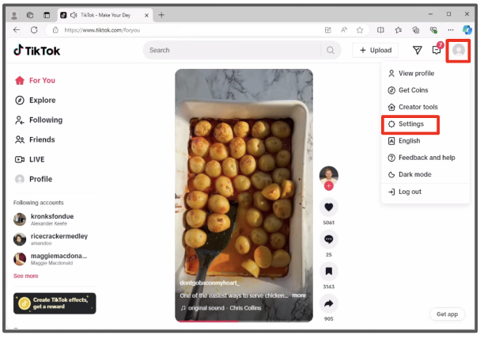
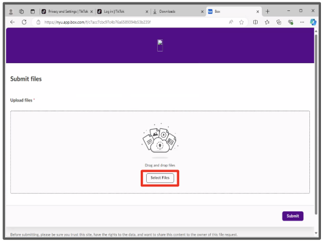
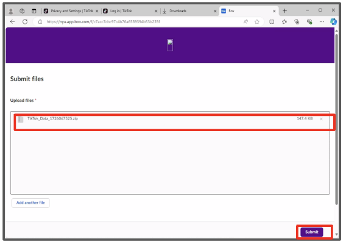

  

# Step 1: Request Your Data

1. In a Microsoft Edge browser, navigate to <a href="https://www.tiktok.com/">TikTok.com</a>, click the round user icon in the top right, then select "Settings".

2. Click "Download your data".

3. Select "JSON", then click "Request data".

<h1 style="text-align: left;"><strong style="font-size: 30px; color: #FF0000">STOP!</strong></h1> 

Your data file won’t be ready immediately. For some users it might take a few minutes and for others it might take up to  <strong>4</strong> days. Remember to check back daily on this screen to see when your data file is ready. We will also be sending out email reminders to check back for it.

   

## Step 2: Download Your Data

4. In a Microsoft Edge browser, return to your "Download Tik Tok data" page (User icon > Settings > Download Your Data) or navigate to <a href="https://tiktok.com/setting/download-your-data">https://tiktok.com/setting/download-your-data</a>. 

5. Click the "Download data" tab at the top if you are currently on the "Request data" tab. Then click "Download" next to the most recent request and enter your password if prompted.

## Step 3: Share Your Data with Researchers

6. Navigate to the data upload page located at <a href="https://nyu.app.box.com/f/c7acc7cbc97c4b76a6589394b53b235f" target="_blank">https://nyu.app.box.com/f/c7acc7cbc97c4b76a6589394b53b235f </a> and click "Select Files".

7. A file explorer window will pop up, click "Downloads", then double click the TikTok data file you have just downloaded (the file name should start "TikTok_Data_"). Alternatively, you can click the data file once and then click "Open".

8. You should now see your data file in the "Upload files" section. (If you do not, return to the previous step and repeat the file selection process.) Click "Submit" in the bottom right corner. You will then see the file upload success page to confirm the data upload is complete.

9.Check for an email from “Google Takeout” with the subject “Your Google data is ready to download.” This may take a while.

10.Download the zip file attachment from Google to your computer.

If you have trouble with these steps, please reach out to <a href="mailto:csmapsupport@nyu.edu">email support</a>. Our team will be in touch to help you troubleshoot. 
