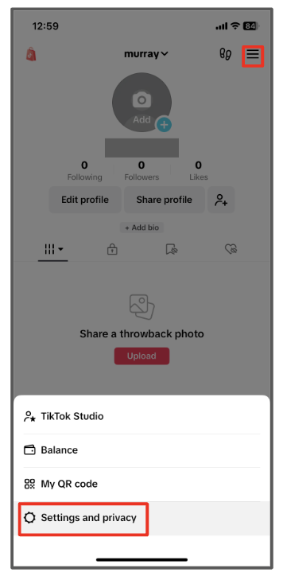
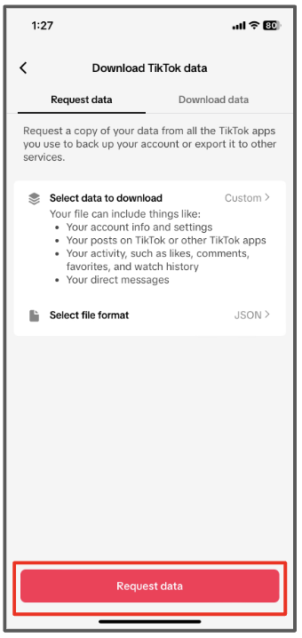
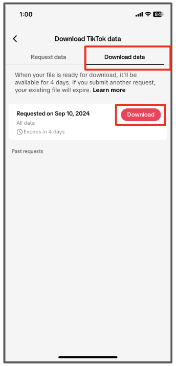
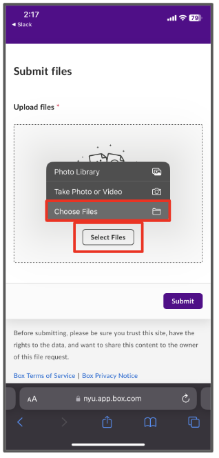

  

## Part 1: Request Your Data

1. In your Tik Tok app, go to your profile and tap the ☰ in the upper right corner. Then tap "Settings and privacy".

2. Tap "Account".

3. Tap "Download your data".

4. Select "select file format" and then tap "JSON" file format and tap "Done".

5. Tap "Request data".

<h1 style="text-align: left;"><strong style="font-size: 30px; color: #FF0000">STOP!</strong></h1> 

Your data file won’t be ready immediately. For some users it might take a few minutes and for others it might take up to <strong>4</strong> days. Remember to check back daily on this screen to see when your data file is ready. We will also be sending out email reminders to check back for it.

  

## Part 2: Download Your Data

	

		
6. Return to your <strong>Download Tik Tok data</strong> page ((Menu > Settings and privacy > Account > Download Your Data)

		
	

	

		
7. Tap the <strong>Download data</strong>tab then select <strong style="color: red">Download</strong>button.

		
	

	

		
8. On the pop-up window that appears, tap the <strong style="color:blue">Download</strong>.

		
	

## Part 3: Share Your Data with Researchers

	

		
Navigate to the data upload page located at: <a href="https://nyu.app.box.com/f/c7acc7cbc97c4b76a6589394b53b235f" target="_blank">https://nyu.app.box.com/f/c7acc7cbc97c4b76a6589394b53b235f</a>  Tap <button>Select Files</button>  Then tap <strong style="color: #6A6767">Choose Files<strong>.

		
	

	

		
Select the <strong>TikTok_Data</strong> file and tap <strong style="color:blue">Open</strong>.

		
	

	

		
Once the file uploads, tap <strong style="color: #57068c">Submit<strong> button.

		
	

	

		
Your file is successfully shared and you can close your browser.

		
	

	If you have trouble with these steps, please reach out to <a href="mailto:csmapsupport@nyu.edu">email support</a>. Our team will be in touch to help you troubleshoot.

 
