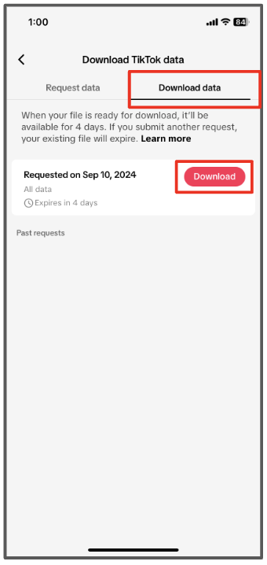

  

## Part 1: Access Your Account and Request Your Data

1. In your Tik Tok app, , go to your profile and tap the ☰ in the upper right corner. Then tap "Settings and privacy".

2. Tap "Account".

3. Tap "Download your data".

4. Select a "JSON" file format and tap "Done".

5. Tap "Request data".

<h1 style="text-align: left;"><strong style="font-size: 30px; color: #FF0000">STOP!</strong></h1> 

Your data file won’t be ready immediately. For some users it might take a few minutes and for others it might take up to  <strong>4</strong> days. Remember to check back daily on this screen to see when your data file is ready. We will also be sending out email reminders to check back for it.

  

## Part 2: Download Your Data

6. Return to your "Download Tik Tok data" page ((Menu > Settings and privacy > Account > Download Your Data)

7. At the top, there are two tabs. Tap the second, "Download data". Then select "Download".

8. If prompted, authenticate your account with your gmail or phone number.

9. This will bring up a page in your browser. Once the page has loaded, press "Open file" at the bottom of the screen.

## Part 3: Share Your Data with Researchers

10. Navigate to the data upload page located at: <a href="https://nyu.app.box.com/f/c7acc7cbc97c4b76a6589394b53b235f" target="_blank">https://nyu.app.box.com/f/c7acc7cbc97c4b76a6589394b53b235f</a> and click "Select Files".

11. This will take you to your phone’s files. Select "Downloads".
On other Android devices, you may need to navigate to the “downloads” folder, such as "media picker".

12. Once within the Downloads file, Select the TikTok file and press "Extract" at the bottom of the screen. Other Android devices might take you directly to the upload.

12. Once you see your file in "Uploaded files" back on the Box upload page, press "Submit" at the bottom of the screen.

13. You will know your file is uploaded once you see this screen. You can then exit your browser.

If you have trouble with these steps, please reach out to <a href="mailto:csmapsupport@nyu.edu">email support</a>. Our team will be in touch to help you troubleshoot.  
