  
# Android Instructions

## Step 1: Request YouTube data from Google Takeout services

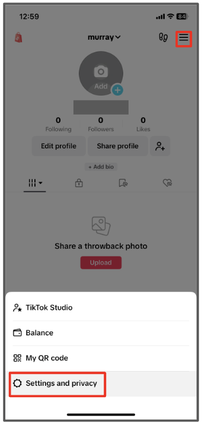
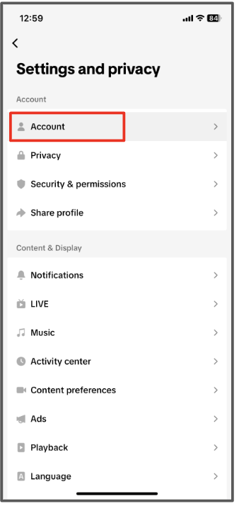
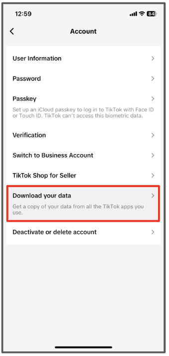
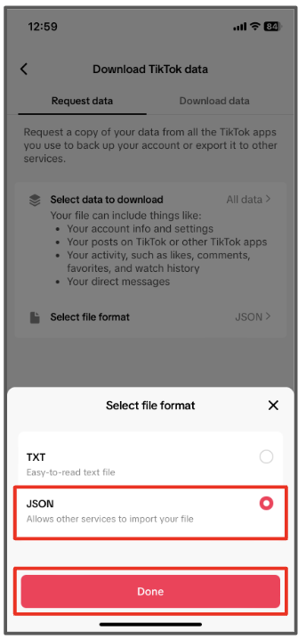

1. Visit this link: <a href="https://takeout.google.com/settings/takeout/custom/youtube" target="new">https://takeout.google.com/settings/takeout/custom/youtube</a>.
2. Scroll down to the section that says "Create a new export."
3. You will see the window "Select data to include" with Products listed as "Youtube and YouTube Music" (pictured below).
4. **Click on the option "All YouTube data included" - this is an important step that will allow you to limit the data that you share.** 

4. On the pop-up window (pictured below), you only need to select the following options: history and subscriptions. 
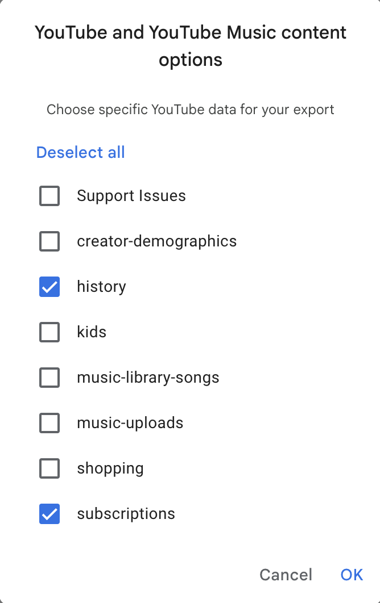 
&nbsp; &nbsp; 
5. Click on “OK.” Then on the original window, click "Next step".
6. In the next window, you can select file type, frequency, and destination. 
 
- For Transfer to:, keep "Send download link via email" selected.
- For Frequency, choose "export once".
- For the File type field, select “.zip”.
- For File size field, select 1 GB. 
- Then click on the blue "Create export" button.
  
*Note: if your file size is larger than 1 GB, you most likely selected more data than requested. Please make sure you unselect “videos” in step 4.*

## Step 2: Wait for your takeout data to become available

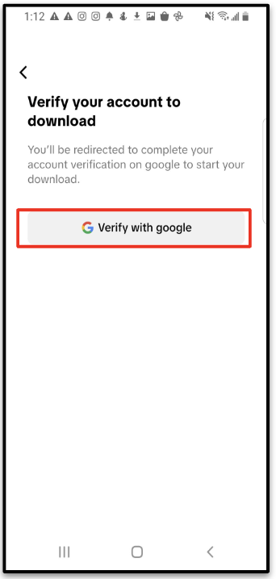
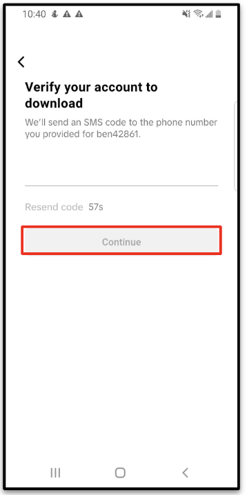
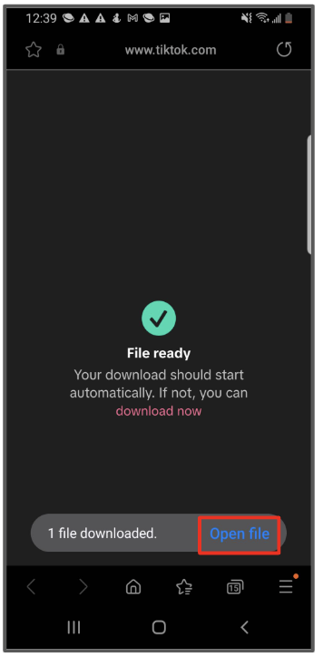
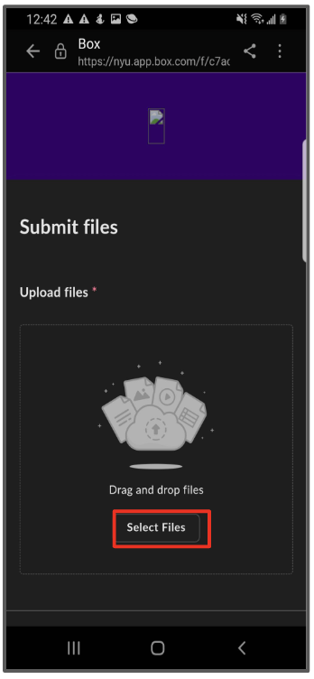
After completing the Google takeout request, it should only be a few minutes before you receive the archive from Google in your inbox. On some rare occasions it can take a few days.

## Step 3: Download your YouTube takeout data

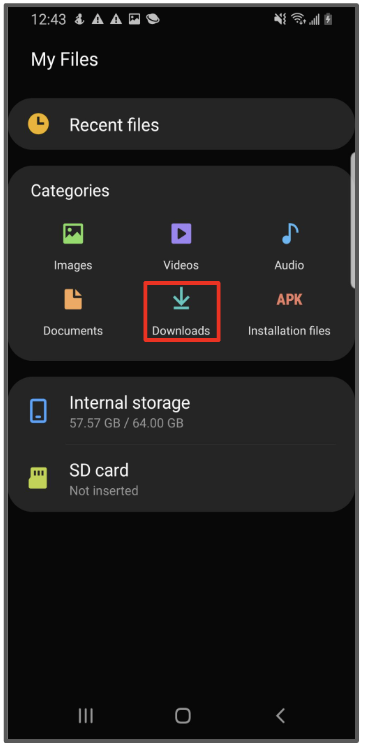
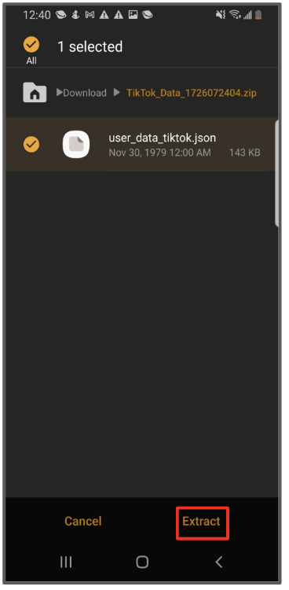
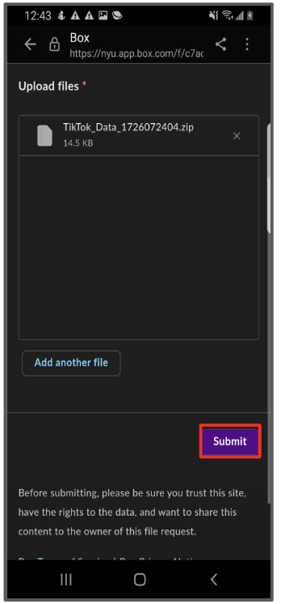
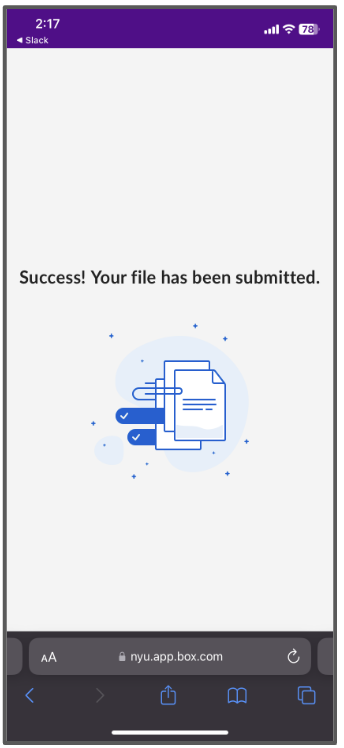

Check for an email from “Google Takeout” with the subject “Your Google data is ready to download.” This may take a while.
Download the zip file attachment from Google to your computer. 

## Step 4: Submit your takeout data to receive points
**You will receive a link from your survey provider with a link to a form. Upload the takeout data zip file using this form.**

If you have trouble with these steps, you can <a href="mailto:csmapsupport@nyu.edu">email support</a>. 
