  

# iOS Instructions

## Step 1: Request Your Data
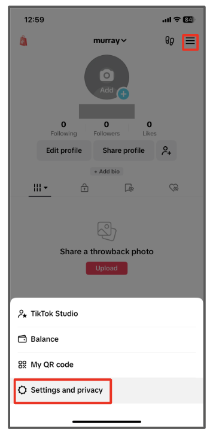
1. In your Tik Tok app, tap the ☰ in the upper right corner. Then tap "Settings and privacy".
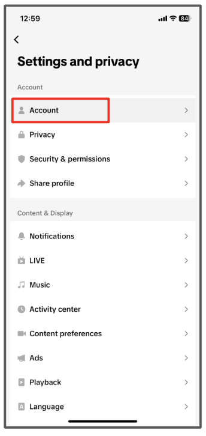
2. Tap "Account".

3. Tap "Download your data".
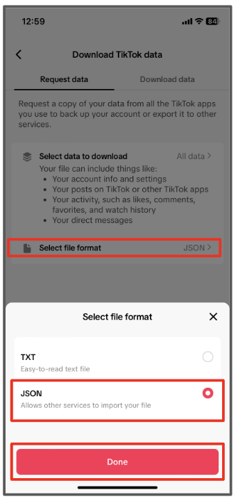
4. Select "select file format" and then tap "JSON" file format and tap "Done". 
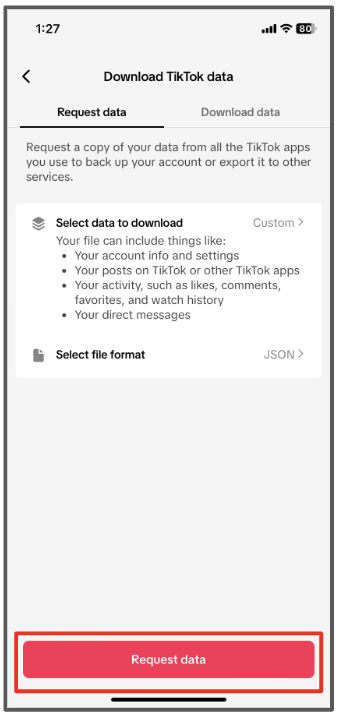
5. Tap "Request data".
<h1 class="blink-two" >
<strong style="font-size: 30px; color: #FF0000">STOP!</strong>
</h1> 
			
Please allow up to <strong>1-4</strong> days for your data to be prepared before proceeding to the next steps.

  
*Note: if your file size is larger than 1 GB, you most likely selected more data than requested. Please make sure you unselect “videos” in step 4.*

## Step 2: Download Your Data

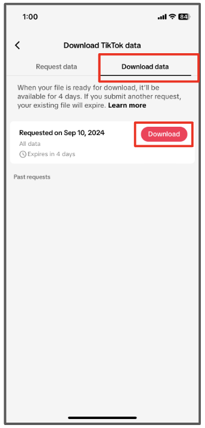
6. Return to your "Download Tik Tok data" page ((Menu > Settings and privacy > Account > Download Your Data)
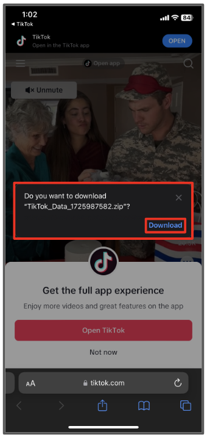
7. At the top, there are two tabs. Tap the second, "Download data". Then select "Download".

8. You will be taken to your phone’s internet browser and a pop-up to download will appear. Tap "Download".
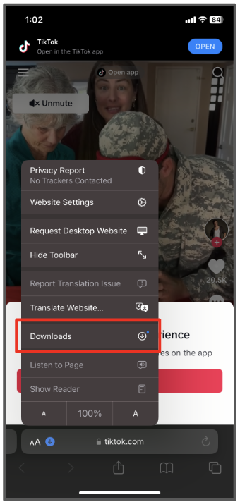
9. It might take a moment. Tap the blue download icon at the bottom left of the screen.
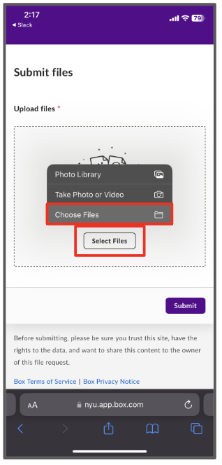
10. Tap "Downloads"

## Step 3: Share Your Data with Researchers

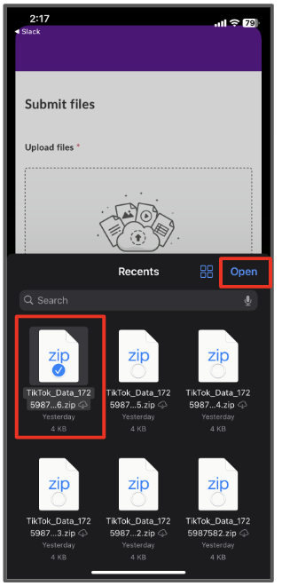
11. Navigate to the data upload page located at: <a href="https://nyu.app.box.com/f/c7acc7cbc97c4b76a6589394b53b235f">https://nyu.app.box.com/f/c7acc7cbc97c4b76a6589394b53b235f</a> Tap "Select Files". Then tap "Choose Files".
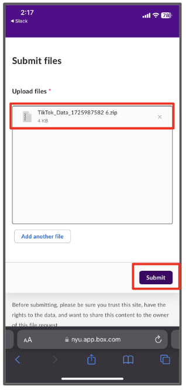
12. This will take you to your phone’s downloads file. Select the Tik Tok file and tap "Open".
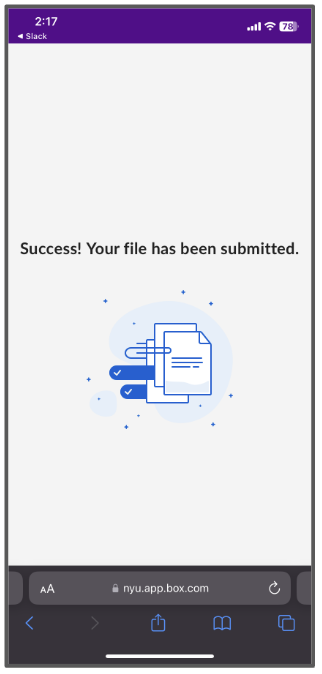
3. Once the file uploads, your screen will look like this. Then tap "Submit".

14. You will know your file is upload once you see this screen. You can then exit your browser.

If you have trouble with these steps, you can <a href="mailto:csmapsupport@nyu.edu">email support</a>. 
