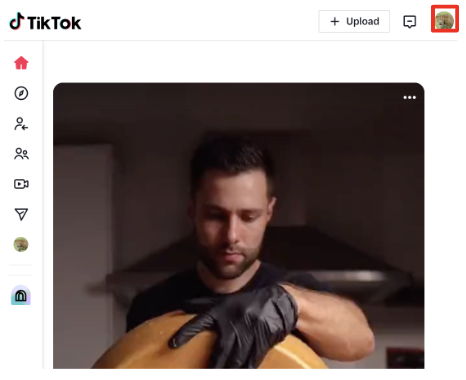
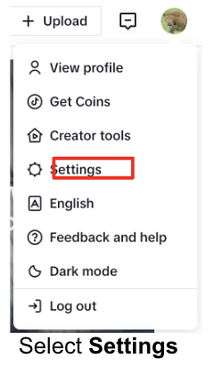
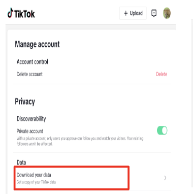
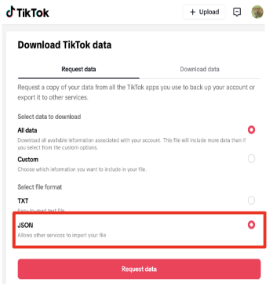
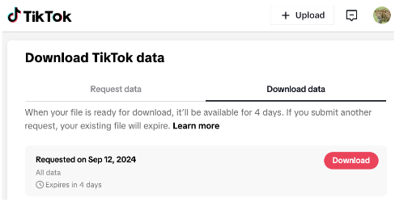
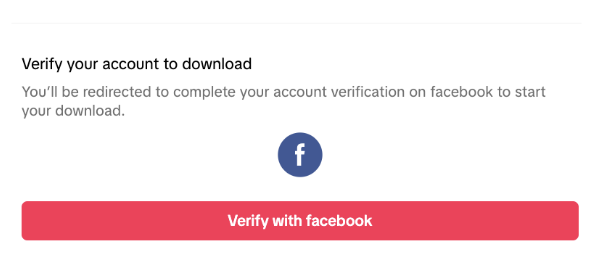
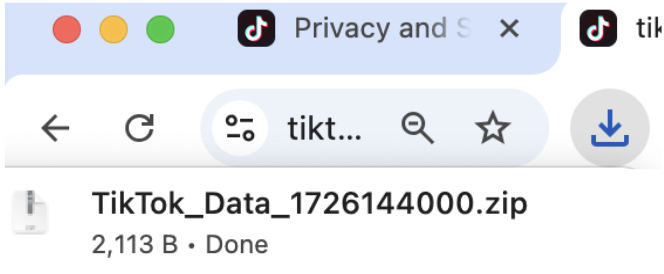

  
# Browser Instructions

## Step 1: Request YouTube data from Google Takeout services

1. In Safari,Chrome browser, navigate to <a href="https://www.tiktok.com/">TikTok</a> and login into your account

2. Click the user icon in the top right 

3. Select "Settings"

4. On the next window select "Data"

5. On  next window select "JSON" then click "Request Data"

## Step 2: Wait for your takeout data to become available

6. Return to your "Download data" page User icon > Settings > Data >  Download data

"Verify" your account to download the data. This is based on login method used. In this case FaceBook was used so you must authenticate with you Facebook login credentials

A download Icon with the data download will appear at the top right corner. Tap this icon to download. The data is automatically downloaded to Download folder or the folder setup for Download on your computer. 

## Step 3: Download your YouTube takeout data

Check for an email from “Google Takeout” with the subject “Your Google data is ready to download.” This may take a while.
Download the zip file attachment from Google to your computer. 

## Step 4: Submit your takeout data to receive points
**You will receive a link from your survey provider with a link to a form. Upload the takeout data zip file using this form.**

If you have trouble with these steps, you can <a href="mailto:csmapsupport@nyu.edu">email support</a>. 
