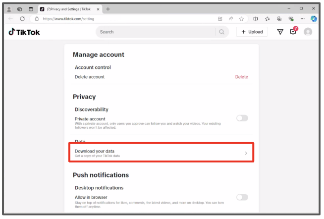

  
# Browser Instructions

## Step 1: Request Your Data

1. In a Microsoft Edge browser, navigate to <a href="https://www.tiktok.com/">TikTok.com</a>, click the round user icon in the top right, then select "Settings".

2. Click "Download your data".

3. Select "JSON", then click "Request data"
<h1 class="blink-two" ><left><strong style="font-size: 30px; color: #FF0000">STOP!</strong></left></h1> 
			Please allow up to <strong>1-4</strong> days for your data to be prepared before proceeding to the next steps.
  

## Step 2: Wait for your takeout data to become available

1. In a Microsoft Edge browser, return to your "Download Tik Tok data" page (User icon > Settings > Download Your Data) or navigate to <a href="https://tiktok.com/setting/download-your-data">https://tiktok.com/setting/download-your-data</a>.

2. Click the "Download data" tab at the top if you are currently on the "Request data" tab. Then click "Download" next to the most recent request and enter your password if prompted

## Step 3: Download your YouTube takeout data

1. Navigate to the data upload page located at <a href="https://nyu.app.box.com/f/c7acc7cbc97c4b76a6589394b53b235f">https://nyu.app.box.com/f/c7acc7cbc97c4b76a6589394b53b235f </a> and click "Select Files".

2. A file explorer window will pop up, click "Downloads", then double click the TikTok data file you have just downloaded (the file name should start "TikTok_Data_"). Alternatively, you can click the data file once and then click "Open".

3. You should now see your data file in the "Upload files" section. (If you do not, return to the previous step and repeat the file selection process.) Click "Submit" in the bottom right corner. You will then see the file upload success page to confirm the data upload is complete.

Check for an email from “Google Takeout” with the subject “Your Google data is ready to download.” This may take a while.
Download the zip file attachment from Google to your computer. 

## Step 4: Submit your takeout data to receive points
**You will receive a link from your survey provider with a link to a form. Upload the takeout data zip file using this form.**

If you have trouble with these steps, you can <a href="mailto:csmapsupport@nyu.edu">email support</a>. 
