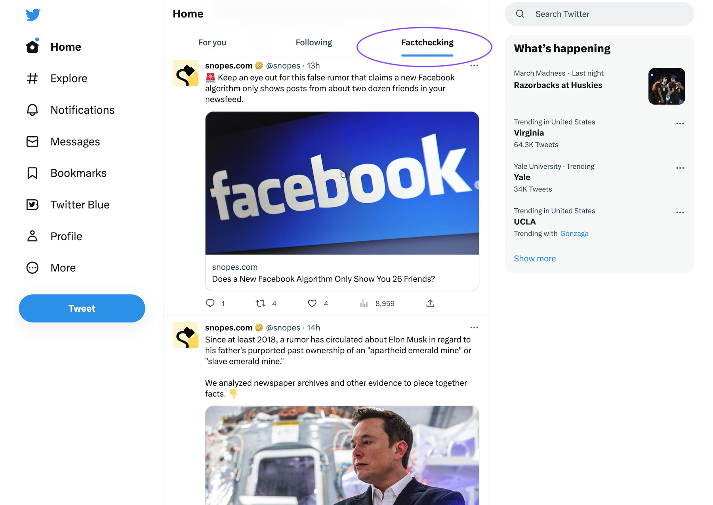
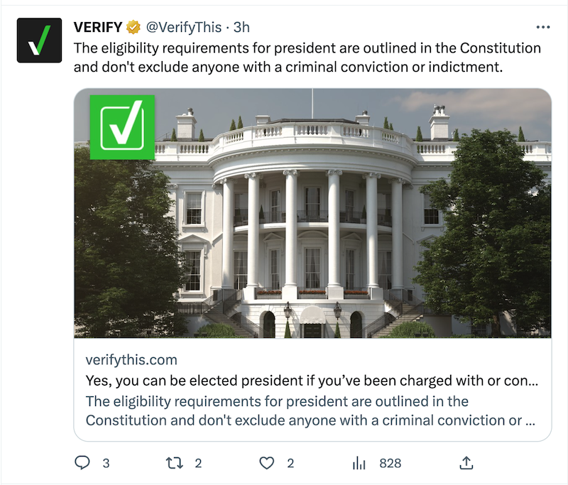
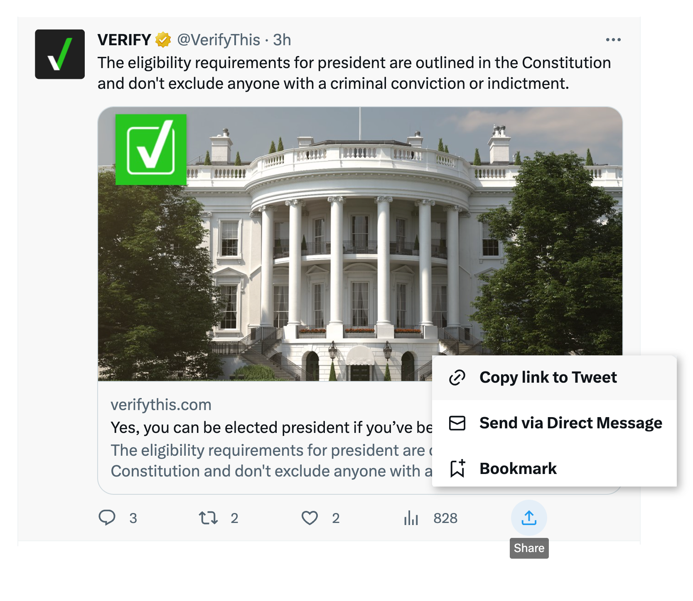

  

## Thank you for enrolling in a study by researchers at the Center for Social Media and Politics at New York University. 

Your participation is helping us to learn more about how people use Twitter in the United States.

**You were assigned to the Fact-Checking Timeline group. As a member of this group in the study, you will see a new timeline of fact-checking organizations added to your Twitter feed.**

This timeline is formed by  Twitter accounts from reputable fact-checking organizations in the United States. These organizations verify the factual accuracy of questioned reporting and statements made by politicians, journalists, government, among others.  

**Remember, this intervention will last for four weeks.** 

### How we added a new timeline to your feed
When you signed up for this study and took our survey, you authenticated your Twitter account. Doing so allowed us to programmatically add a list of fact-checking organizations to your account. This is the only intervention we will make for this study. 

You can access this fact-checking in the top header of your Twitter feed (see below).

 

In addition, the accounts added to the Fact-Checking Timeline will also appear on your "For you" and "Following" feeds. 

### You need to visit the fact-checking Twitter timeline regularly for a month.

To be sure you are paying attention to this new timeline we added to your Twitter feed, we will ask you to send us examples of the tweets that appear in the timeline.

Over the course of the study, you can submit up to 15 screenshots for the maximum rewards of our study.

This is how you do it:

1. Scroll through the Tweets on the Fact-checking feed and see if you find anything interesting.

2. Each day, you will receive a link to a survey asking you to submit a link or a screenshot of a Tweet that you found interesting on the fact-checking timeline. (For instructions on creating a screenshot on your current device, visit <a href="https://www.take-a-screenshot.org/">https://www.take-a-screenshot.org/</a>.) 
3. You will also be asked to type a 1-2 sentence response about why you found the Tweet interesting.

#### Example 1: Screen capture of Tweet

Example of a Tweet screenshot, this is all the info that needs to be included in the screenshot (To respect your privacy, we ask you not screen capture your entire desktop or Twitter interface.)

#### Example 2: Copying link to Tweet

Example of copying a link to a Tweet, an alternative to sharing a screenshot.

### Rewards can be earned as follows:
At the end of the four weeks, we will invite you to complete a 10-minute questionnaire. If you follow the study rules: submit Twitter screenshots or links through survey links you receive via email, and answer the final questionnaire, you will receive a gift card. 

The amount of the gift card depends on how many of the following tasks you are able to complete: 
- Initial survey: $2
- Screenshots/links:
  - At least 10 screenshots/links: $18 or
  - Between 5 and 10 screenshots/links: $13 or
  - Less than 5 screenshots: no additional compensation
- Final survey: $5

As an active participant, you can earn up to $25 (by completing both surveys and submitting at least 10 Twitter screenshots or links). You will only be compensated for the number of tasks you complete successfully.

### When will I see my rewards?
This study continues through TK. We will screen submissions for completeness and distribute rewards by TK.

If you have any questions or need support, please email <a href="mailto:nyutwittersurveys@gmail.com">nyutwittersurveys@gmail.com</a>.

You can learn more about us here: <a href="https://www.csmapnyu.org" target="new">csmapnyu.org</a>.

