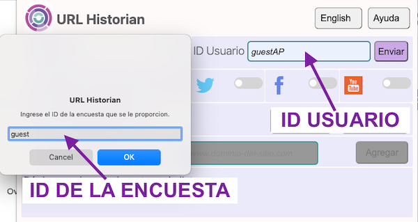
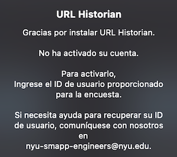
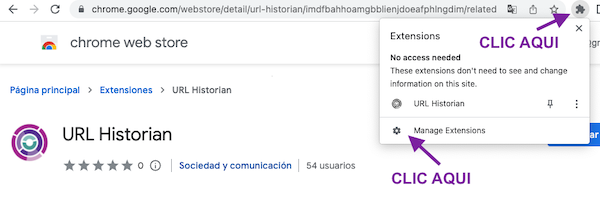
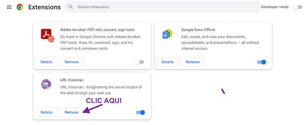

# Preguntas Frecuentes

	
<html>
<head>
	
</head>
<body>

<h3>Gracias por descargar URL Historian de CSMap. Esta página brinda orientación sobre los problemas que podrían surgir al usar la extensión. </h3>

	
&nbsp;

	<strong>Table of contents</strong>
	
	<ul>
		<li><a href="#activate">¿Cómo registro y activo la extensión?</a></li>
	<li><a href="#forget">Por qué sigue apareciendo una ventana emergente después de instalar la extensión?</a></li>
	<li><a href="#survey">¿Cómo obtengo un Survey ID (ID de la encuesta) y un User ID (ID de usuario)?</a></li>
	<li><a href="#remove">Ya no deseo participar. ¿Cómo elimino la extensión de mi navegador Chrome? </a></li>
	<li><a href="#html">¿Qué hacen los botones de activación junto a los íconos de Twitter, Facebook y YouTube?</a></li>
	<li><a href="#pause">¿Qué opciones están disponibles si en ocasiones no quiero compartir datos?</a></li>
	<li><a href="#delete">¿Hay alguna manera de eliminar datos que no quise compartir?</a></li>
	<li><a href="blacklist">¿Puedo evitar que la extensión recopile visitas a sitios web que quiero mantener privadas?</a></li>
	<li><a href="#assistance">¿Cómo me comunico con soporte?</a></li>

	</ul>
	
	

<h2 id="activate">¿Cómo registro y activo la extensión?</h2>
	
Recibirá un ID de usuario y un ID de la encuesta cuando complete una encuesta de CSMap y exprese interés en instalar la extensión URL Historian. Estos ID se compartirán en la encuesta o en un correo electrónico después de completar la encuesta.

	

Después de instalar la extensión, puede acceder a la ventana de URL Historian seleccionando la extensión en el menú de extensión de Chrome al que se puede acceder junto a la barra de direcciones (icono de la pieza del rompecabezas).

<ol>		
	<li>En la ventana de extensión, verá un campo para ingresar su ID de usuario.</li>
<li>Después de ingresar su ID de usuario, verá una pantalla emergente que le solicitará ingresar su ID de la encuesta.</li>
<li>Después de ingresar su ID de la encuesta, la configuración estará completa. La extensión comenzará a recopilar su historial web automáticamente.</li>
	</ol>

	

	
	
	<h2 id="forget">¿Por qué sigue apareciendo una ventana emergente después de instalar la extensión?</h2>
	
Si instaló la extensión y ve una ventana emergente (en la foto de abajo), deberá registrar la extensión. Consulte las <a href="activate">instrucciones anteriores</a> para completar ese paso.

	

	

	
	
	<h2 id="survey">¿Cómo obtengo un ID de la encuesta y un ID de usuario?</h2>
	
Su<strong>ID de la encuesta</strong> se proporciona junto con su <strong>ID de usuario</strong> a través de un correo electrónico que se le envía o a través de un enlace para instalar y activar la extensión.

	
Su ID de la encuesta y su ID de usuario se proporcionan en la encuesta y por correo electrónico cuando acepta instalar la extensión. Si ya no tiene acceso a estos códigos, puede solicitar un código enviando un correo electrónico a <a href="mailto:csmap-surveys@nyu.edu">csmap-surveys@nyu.edu</a> e indicando dónde completó la encuesta.

	

	

	
	<h2 id="remove">Ya no quiero participar. ¿Cómo elimino la extensión de mi navegador Chrome?</h2>
	
	
Se puede quitar la extensión de dos maneras.

	
A través del navegador Chrome:

<ol>
	<li>Vaya al menú de extensión en su navegador Chrome, ubicado junto a la barra de direcciones (icono de la pieza del rompecabezas).</li> 
<li>En el menú de extensiones, verá URL Historian en la lista. Seleccione los tres puntos junto al nombre de la extensión para mostrar un submenú. El submenú proporciona la opción “Eliminar de Chrome...” para desinstalar la extensión.</li>
	</ol>
	
Como alternativa, puede visitar la página <a href="https://chrome.google.com/webstore/detail/url-historian/imdfbahhoamgbblienjdoeafphlngdim/related?hl=en">URL Historian</a> en la tienda de Chrome. Haga clic en el botón azul “Eliminar de Chrome” en la esquina superior derecha. 

	

	

	

	<h2 id="html">¿Qué hacen los botones de activación junto a los íconos de Twitter, Facebook y YouTube?</h2>
	
Los botones de activación junto a los iconos de las redes sociales permiten compartir datos que aparecen en estos sitios web. Compartir estos datos es opcional y no es obligatorio. Cada sitio de redes sociales se activa por separado.
<ul>
	<li>La opción de Twitter recopilará datos de tuits cuando visite twitter.com.</li>
	<li>La opción de YouTube recopilará videos listados al visitar youtube.com.</li>
	<li>La opción de Facebook recopilará únicamente las URL que aparezcan en su feed de noticias de Facebook cuando visite facebook.com.</li> 
</ul>

	

	<h2 id="pause">¿Qué opciones están disponibles si en ocasiones no quiero compartir datos?</h2>
	
El botón de activación en la parte superior izquierda de la ventana de extensión le permite pausar y reanudar la recopilación de datos en cualquier momento. Cuando el botón de activación está “Activo”, la extensión está recopilando URL de los sitios que visita.

	<ol>
		<li>Deslice el botón de activación hacia la izquierda para pausar la recopilación de datos y hacia la derecha para reanudarla.</li>
		<li>Después de que la extensión esté en pausa durante 60 minutos, aparecerá una ventana emergente recordándole que debe reanudar la actividad. Después del primer recordatorio, aparecerán recordatorios de seguimiento cada cuatro horas.</li>
	</ol>
	
		

 	<h2 id="delete">¿Hay alguna manera de eliminar datos que no quise compartir?
</h2>
	
	
Dentro de URL Historian, puede eliminar los datos compartidos hasta por diez días después de que se recopilaron.

	
La función Eliminar historial de navegación le permite eliminar datos por hora o por fecha.

	<ul>
		<li>Por hora le permite eliminar datos por hora.</li>
		<li>Por fecha le permite eliminar datos de los días que seleccione.</li>
	</ul>

Cuando borra datos dentro de la extensión, se hace efectivo de inmediato y eliminará los registros seleccionados de nuestro servidor.

Si han pasado más de diez días desde que se recopilaron los datos, puede comunicarse con NYU CSMap Engineers en csmap-engineers@nyu.edu para solicitar que se eliminen sus datos. Incluya las fechas u horas de recopilación que necesita eliminar.

	
	
	<strong>Por tiempo:</strong>
	

		<video width="560" height="373" controls>
	  		<source src="videos/uh_delbytime_es.mov" type="video/mp4">
		</video>
	

	
	<strong>Por fecha:</strong>
	

		<video width="560" height="420" controls>
	  		<source src="videos/uh_delbydate_es.mov" type="video/mp4">
		</video>
	

	

	
	<h2 id="blacklist">¿Puedo evitar que la extensión grabe visitas a sitios web que deseo mantener privadas?</h2>
	
El campo Agregar sitio web a la lista negra le permite ingresar la dirección de los dominios que no desea compartir. Ingrese cualquier URL en el formato www.domain.com en el campo Agregar sitio web a la lista negra. Las visitas a estos sitios web quedarán bloqueadas de la recopilación. Verá todos los dominios bloqueados en el campo Sitios web actualmente en la lista negra.

	
	
	

		<video width="560" height="420" controls>
  			<source src="videos/uh_blacklist.mp4" type="video/mp4">
		</video>

<!-- Unblacklist -->

		<!--<video width="300" height="240" controls>
     <source src="videos/uh_unblacklist_es.mov" type="video/mp4"></video>-->

	<h2 id="assistance">¿Cómo me comunico con soporte?</h2>
	<ol>
	<li>Para preguntas sobre el uso de la extensión, para solicitar que se eliminen sus datos u otros problemas técnicos, comuníquese con <a href="mailto:csmap-engineers@nyu.edu">csmap-engineers@nyu.edu</a>.</li>
<li>Para preguntas sobre los datos que recopilamos o proyectos de investigación que puedan usar sus datos, comuníquese con <a href="mailto:csmap-surveys@nyu.edu">csmap-surveys@nyu.edu</a>.</li>
	</ol>

<a href="#top">Return to top </a>

