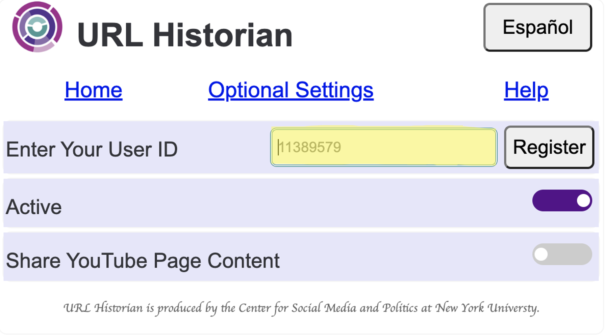
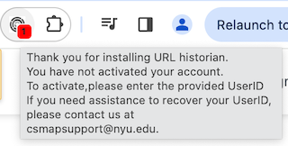
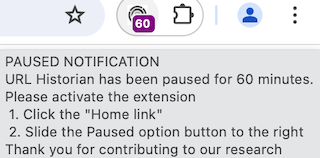

### Frequently Asked Questions

<html>
<head>
	
</head>
<body>

Thank you for downloading CSMaP's URL Historian. This page provides guidance to issues that might come up when using the extension. 

	<strong style="font-size: 20px;">Table of contents</strong>
	<ul>
		<li><a href="#survey">How do I get a User ID?</a></li>
		<li><a href="#activate">How do I register and activate the extension?</a></li>
		<li><a href="#forget">Why does a popup window keep appearing after installing the extension?</a></li>
		<li><a href="#remove">I no longer wish to participate. How do I remove the extension from my Chrome browser?</a></li>
		<li><a href="#html">What does the toggle next to "Share YouTube Page Content" do?</a></li>
		<li><a href="#pause">What options are available if there are times I don’t want to share data?</a></li>
		<li><a href="#delete">Is there a way to delete data that I didn’t mean to share?</a></li>
		<li><a href="#blacklist">Can I prevent the extension from recording visits to websites that I wish to keep private?</a></li>
		<li><a href="#assistance">How do I contact support?</a></li>
	</ul>

	<h2 id="survey">How do I get a User ID?</h2>
	
Your <strong>User ID</strong> is provided either through an email sent to you or with a link to install and activate the extension when you consent to share your web history using URL Historian in a survey. If you no longer have access to your User ID, you can request one by emailing <a href="mailto:csmapsupport@nyu.edu">csmapsupport@nyu.edu</a> and referencing where you completed the survey.

	<a href="#top">Return to top</a>

	<h2 id="activate">How do I register and activate the extension?</h2>
	
After you install the extension, use the User ID <a href="#survey"> provided </a> and do the following

	<ol>	
		<li>On the extension <strong>Home</strong> tab, enter the User ID in the field <strong>Enter your User ID</strong>. as shown below on the highlighted section.</li>
		

		<li>After entering your User ID, press the <strong>Register</strong> button</li>
		<li>The extension will now be registered and activated to automatically collect your web history.</li>
	</ol>
	<a href="#top">Return to top </a>

	<h2 id="forget">Why does a popup window appear after installing the extension?</h2>
	
If you installed the extension and did not register and activate it, a red pop-up window will appear next to the extension icon (pictured below) to remind you to register the extension

	

	
 To fix this you will need to <a href="#activate">register and activate the extension</a> 

	<a href="#top">Return to top </a>

	<h2 id="remove">I no longer want to participate. How do I remove the extension from my Chrome browser?</h2>
	
You can remove the extension from your Chrome browser in two ways.

	
First, you can remove it through the Chrome browser:

	<ol>
		<li>Go to the extension menu in your Chrome browser, located next to the address bar (puzzle piece icon).</li> 
		<li>From the extensions menu, you will see URL Historian listed. Select the three dots next to the extension name to reveal a submenu. The submenu provides the option <strong>Remove from Chrome…</strong>  to uninstall the extension.</li>
	</ol>
	
Alternatively, visit the <a href="https://chrome.google.com/webstore/detail/url-historian/imdfbahhoamgbblienjdoeafphlngdim/related?hl=en">URL Historian</a> listing on the Chrome webstore. Click the <strong style="color:blue"> Remove from Chrome</strong> button in the top right corner 

	<h2 id="html">What does the toggle button next to <strong>Share YouTube Page Content</strong> do?</h2>
	
The toggle button next to <strong>Share YouTube Page Content</strong> allows URL Historian to capture page content from YouTube videos you click to watch. Page content capture only occurs if the <strong>Share YouTube Page Content</strong> button is slid to the right

	<h2 id="pause">What options are available if there are times I don’t want to share data?</h2>
	
The toggle button next to <strong>Active</strong> label on the left side of the extension window allows you to pause and resume data collection at any time

	<ul>
		<li>When the toggle is in <strong>Paused</strong> state, the extension does not collect URLs or Youtube page content
		</li>
		<li>When the toggle is in <strong>Active</strong> state, the extension is collecting URLs and <a href="#html">Share YouTube Page Content</a> </li>
	</ul>
	
Slide the toggle button to the left to pause data collection, and to the right to resume data collection.

	<strong>Note</strong> 
	
After the extension is paused for 60 minutes, a purple popup window will appear next to the extension (picture below) to remind you to activate the extension

	

	<a href="#top">Return to top</a>

 	<h2 id="delete">Is there a way to delete data that I didn’t mean to share?</h2>
	
You can immediately delete your individual data collected in the past 10 days from our server by clicking either the <strong>by Date</strong> or <strong>by Time</strong> buttons which are located in the <strong>Optional Settings</strong> 
	<strong>by Time</strong>--Deletes data collected for the selected hour range or single hour 
	<strong>by Date</strong>--Deletes all the data collected for the selected day 
	To delete data, follow the steps below

	<ol>
		<li>Select a data sources: <italic>YouTube</italic> or <italic>All other browsing data</italic>.Selecting a single data source deletes data from that source only and selecting both data sources deletes data from both</li>
		<li>Select Your Timezone e.g. Eastern timezone </li>
		<li>Select a Date. The date you want the data to be deleted</li>
		<li>Select Time. For <strong>by Time</strong> deletion only. Select an hour range or single hour. </li>	
	</ol>
	
Below is an example of delete <strong>by Date</strong>

	<video align="center" width="320" height="240" controls><source src="videos/uh_new/uh_delbydate.mp4" type="video/mp4"></video>
	
If you wish to delete data collected beyond 10 days <a href="#assistance"> contact our engineers </a>. Please include your user ID and date(s) of collection you need deleted. If deleting by Time include the date and the hour or our range you wish to be deleted

	<h2 id="blacklist">Can I prevent the extension from recording visits to websites that I wish to keep private?</h2>
	
The <strong>Add URLs to Blacklist</strong> allows you to enter the address of domains you do not wish to share. You can access this feature by clicking on the <strong>Optional Settings</strong>

	
Visits to the websites added to the blacklist will be blocked from collection. You will see all blocked domains Websites Currently Blacklisted field.

	
Below is an example of how to <strong>Add URLs to Blacklist</strong> below 

	<video align="center" width="320" height="240" controls><source src="videos/uh_new/uh_blacklist.mp4" type="video/mp4"></video>

	<h2 id="assistance">How do I contact support?</h2>
	
For questions about using the extension, the data we collect, the research projects themselves, to request your data be deleted or other technical problems, please reach out to <a href="mailto:csmapsupport@nyu.edu">csmapsupport@nyu.edu</a>. 
	Thank you for supporting our research!

	<a href="#top">Return to top </a>

