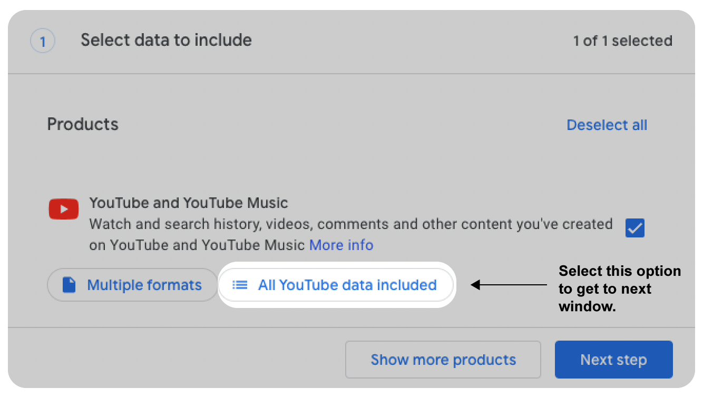
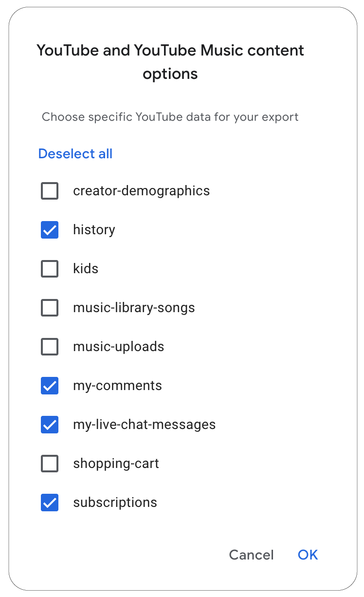
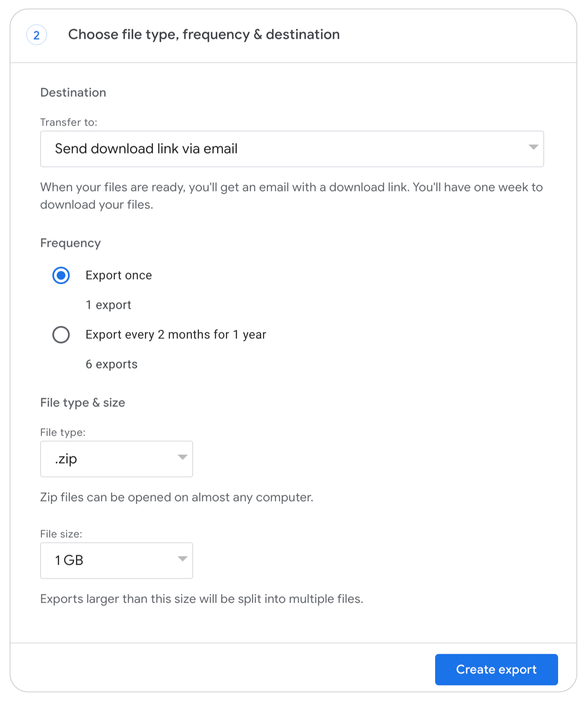

  
# Instructions for contributing YouTube Data

## Step 1: Request YouTube data from Google Takeout services

1. Visit this link: <a href="https://takeout.google.com/settings/takeout/custom/youtube" target="new">https://takeout.google.com/settings/takeout/custom/youtube</a>.
2. Scroll down to the section that says "Create a new export."
3. You will see the window "Select data to incude" with Products listed as "Youtube and YouTube Music" (pictured below).
4. Click on the option "All YouTube data included" - this is an important steps that will allow you to limit the data that you share. 

4. On the pop-up window (pictured below), only check off options: history, my-comments, my-live-chat-messages, and subscriptions. 
 

5. Click on “OK.” Then on the original window, click "Next step".
6. In the next window, you can select file type, frequency, and destination. 
 
- For Transfer to:, keep "Send download link via email" selected.
- For Frequency, choose "export once".
- For the File type field, select “.zip”.
- For File size field, select 1 GB. 
- The click on the blue "Create export" button.
  
*Note: if your file size is larger than 1 GB, you most likely selected more data than requested. Please make sure you unselect “videos” in step 4.*

## Step 2: Wait for your takeout data to become available
After completing the Goolge takeout request, it should only be a few minutes before you receive the archive from Google in your inbox. On some rare occasions it can take a few days.

## Step 3: Submit your takeout data to receive points
When the archive is ready, you will receive an email from “Google Takeout” with the subject “Your Google data is ready to download.”

After you download the takeout data to your computer, you are ready to upload it to the study. **You can upload the file that ends in ".zip" to the personalized link provided to you in the email after you completed your survey.**

Please email csmapsupport@nyu.edu with the subject line "YouTube takeout" if you have any issues with these steps.

