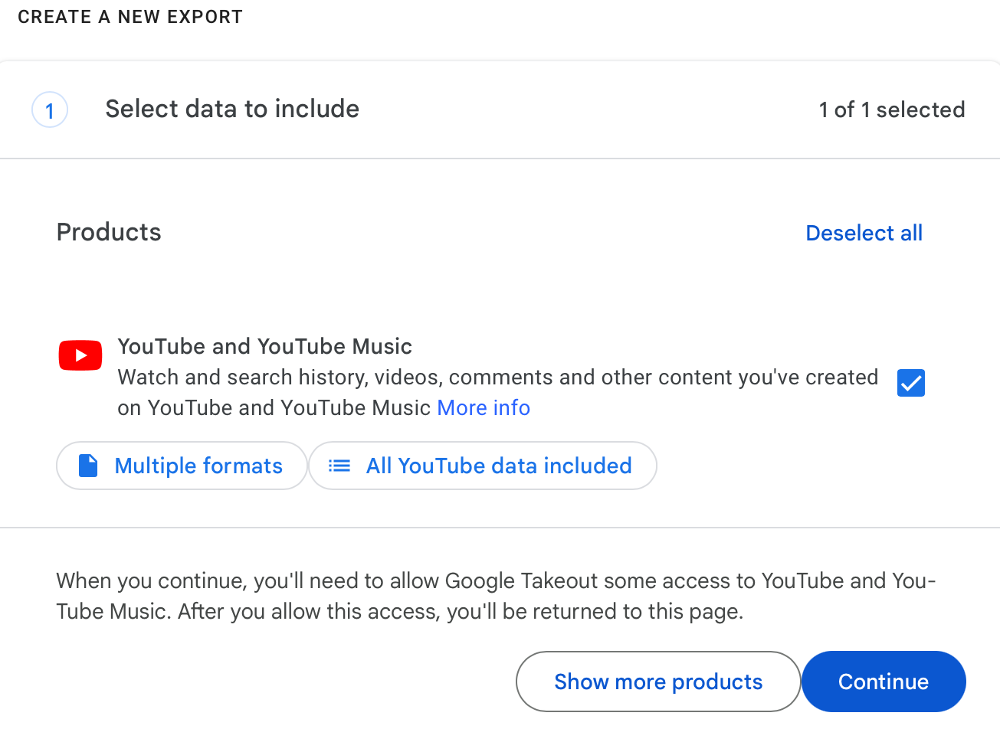

  
# Instructions for contributing YouTube Data

## Step 1: Request YouTube data from Google Takeout services

1. Visit this link: <a href="https://takeout.google.com/settings/takeout/custom/youtube">https://takeout.google.com/settings/takeout/custom/youtube</a>.
2. On this page you will see the window "Select data to incude" (pictured below). 

3. Click on the option "All YouTube data included" - this will allow you to limit the data that you share.
4. On the pop-up window (pictured below), only check off options: history, my-comments, my-live-chat-messages, and subscriptions. 
 
5. Click on “OK.” Then on the original window, click "Next step".
6. In the next windowyou can select file type, frequency, and destination. 
 
- For frequency, choose "export once".
- For the file format field, select “.zip”.
- For file size, select 1 GB. 
*Note: if your file size is larger than 1 GB, you most likely selected more data than requested. Please make sure you unselect “videos” in step 4.*

## Step 2: Wait for your takeout data to become available
After completing these steps, it may take Google anywhere from 1 hour to a few days to send you the data archive.

## Step 3: Submit your takeout data to receive points
When the archive is ready, you will receive an email from “Google Takeout” with the subject “Your Google Data is ready to download.”

After you download your takeout data, you are ready to upload your data to the study <button><a href="https://www.csmapsurveys.org/youtube_takeout.html">upload form</a></button>.
You will also need your User ID and Survey ID.

Please email csmapsupport@nyu.edu with the subject line "YouTube takeout" if you have any issues with these steps.

