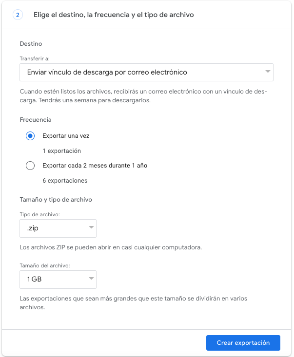

  
# Instrucciones

## Paso 1: Solicite sus datos de YouTube con los servicios de Google Takeout

1. Visite este enlace: <a href="https://takeout.google.com/settings/takeout/custom/youtube" target="new">https://takeout.google.com/settings/takeout/custom/youtube</a>.
2. Desplácese hacia abajo hasta la sección que dice "Crear una nueva exportación"
3. Verá la ventana "Seleccionar datos a incluir" que enumera los diferentes productos como "YouTube y YouTube Music" (en la siguiente imagen).
4. **Haga clic en la opción "Todos los datos de YouTube incluidos": este es un paso importante que le permitirá limitar los datos que comparte.** 

5.En la ventana emergente (que se muestra a continuación), solo marque las opciones: historial, mis comentarios, mis mensajes de chat en vivo y suscripciones.  
 
&nbsp; &nbsp; 
6. Haga clic en "Aceptar". Luego, en la ventana original, haga clic en "Siguiente paso."
7. En la siguiente ventana, puede seleccionar el tipo de archivo, la frecuencia y el destino. 
 
- En Transferir a, mantenga seleccionado "Enviar enlace de descarga por correo electrónico."
- En Frecuencia, elija "exportar una vez."
- En el campo Tipo de archivo, seleccione ".zip."
- En el campo Tamaño de archivo, seleccione 1 GB.
- Luego haga clic en el botón azul "Crear exportación". 
  
*Nota: si el tamaño del archivo es superior a 1 GB, lo más probable es que haya seleccionado más datos de los solicitados. Asegúrese de quitar la selección de "videos" en el paso 4*

## Paso 2: Espere a que sus datos para llevar estén disponibles
Después de completar la solicitud de Google Takeout, solo deben pasar unos minutos antes de que reciba el archivo de Google en su bandeja de entrada. En algunas raras ocasiones puede tardar unos días.

## Paso 3: Descargue sus datos de YouTube Takeout
Busque un correo electrónico de "Google Takeout" con el asunto "Sus datos de Google están listos para descargar". Esto puede tardar un rato. Descargue el archivo adjunto zip de Google a su computadora.
## Paso 4: Envíe los datos que recibió de Takeout para recibir puntos
 
 **Recibirá un enlace de su proveedor de encuestas con un enlace a un formulario. Cargue el archivo Takout zip de datos utilizando este formulario.**

Please email csmapsupport@nyu.edu with the subject line "YouTube takeout" if you have any issues with these steps.

